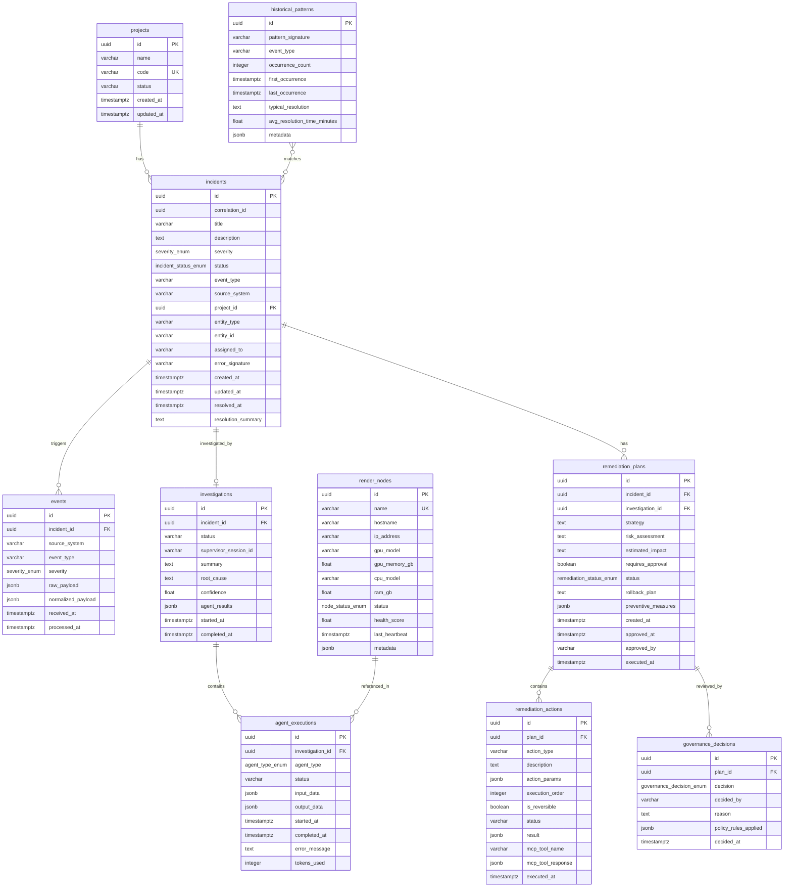
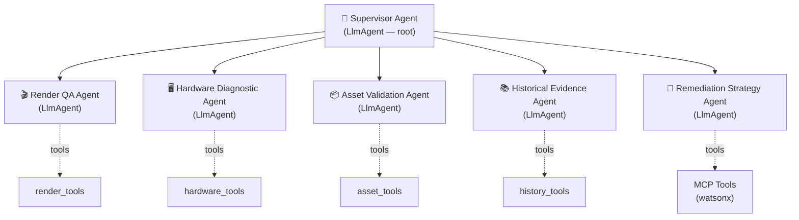

# VFX Pipeline Incident Investigation & Remediation Platform

## Architecture Document — v1.0 (MVP)

---

## 1. System Overview

This platform is an **event-driven, multi-agent system** that automatically investigates and remediates incidents in VFX production pipelines. It ingests events from production systems (ShotGrid, Deadline, Tractor, OpenCue, asset storage), uses a Google ADK-orchestrated team of specialist AI agents to diagnose root causes, and executes remediation workflows through an MCP-connected IBM watsonx Orchestrate server — all governed by configurable policies and human-in-the-loop approval.

### High-Level Data Flow

```
VFX Production Systems (ShotGrid, Deadline, Tractor, OpenCue, USD/Alembic/VDB)
        │
        ▼
┌─────────────────────────────────────────┐
│   Event Ingestion & Normalizer Service  │  ← FastAPI webhooks
│   (normalize heterogeneous events)      │
└──────────────────┬──────────────────────┘
                   │  Redis Streams: vfx.events.normalized
                   ▼
┌─────────────────────────────────────────┐
│      Incident Manager Service           │  ← Correlate, deduplicate, create incidents
│      (core domain logic)                │
└──────────────────┬──────────────────────┘
                   │  Redis Streams: incidents.created
                   ▼
┌─────────────────────────────────────────┐
│     Agent Orchestrator Service          │  ← Google ADK multi-agent system
│  ┌─────────────────────────────────┐    │
│  │  Supervisor Agent (Router)      │    │
│  │  ┌───────────┐ ┌─────────────┐  │    │
│  │  │ Render QA  │ │  Hardware   │  │    │
│  │  │  Agent     │ │  Diagnostic │  │    │
│  │  └───────────┘ └─────────────┘  │    │
│  │  ┌───────────┐ ┌─────────────┐  │    │
│  │  │  Asset     │ │  Historical │  │    │
│  │  │ Validation │ │  Evidence   │  │    │
│  │  └───────────┘ └─────────────┘  │    │
│  │  ┌───────────────────────────┐  │    │
│  │  │ Remediation Strategy Agent│  │    │
│  │  └───────────────────────────┘  │    │
│  └─────────────────────────────────┘    │
└──────────────────┬──────────────────────┘
                   │  Redis Streams: remediations.proposed
                   ▼
┌─────────────────────────────────────────┐
│      Governance Service                 │  ← Policy engine + HITL approval
└──────────────────┬──────────────────────┘
                   │  Redis Streams: governance.decisions
                   ▼
┌─────────────────────────────────────────┐
│      MCP Client (in Agent Orchestrator) │
│              ▼                          │
│  ┌────────────────────────────────┐     │
│  │ IBM watsonx Orchestrate        │     │
│  │ MCP Server (MOCK for MVP)      │     │
│  │ ┌────────┐ ┌──────────┐       │     │
│  │ │Assign  │ │Retry Job │       │     │
│  │ │  TD    │ │on Healthy│       │     │
│  │ │        │ │  Node    │       │     │
│  │ └────────┘ └──────────┘       │     │
│  │ ┌────────┐ ┌──────────┐       │     │
│  │ │Update  │ │Create    │       │     │
│  │ │  Shot  │ │ Ticket   │       │     │
│  │ │Status  │ │          │       │     │
│  │ └────────┘ └──────────┘       │     │
│  │ ┌────────┐ ┌──────────┐       │     │
│  │ │Notify  │ │Generate  │       │     │
│  │ │ Team   │ │Post-     │       │     │
│  │ │        │ │Mortem    │       │     │
│  │ └────────┘ └──────────┘       │     │
│  └────────────────────────────────┘     │
└──────────────────┬──────────────────────┘
                   │  Redis Streams: remediations.executed
                   ▼
┌─────────────────────────────────────────┐
│  Interactive Mission Control Dashboard  │  ← Next.js + WebSocket
└─────────────────────────────────────────┘
```

---

## 2. Bounded Contexts & Services

The platform is decomposed into **six bounded contexts**, each implemented as an independent service with its own API surface and clear domain boundaries.

### 2.1 Event Ingestion Context (`event-ingestion`)

| Attribute | Value |
|---|---|
| **Responsibility** | Receive raw webhooks from VFX systems, validate payloads, normalize into a canonical event schema, publish to the event bus |
| **Technology** | FastAPI, Redis Streams (producer) |
| **Port** | 8001 |
| **Owns** | Raw event payloads, normalizer adapters per source system |
| **Publishes** | `vfx.events.normalized` |

**Key design decisions:**
- Each VFX source system has a dedicated normalizer adapter (Strategy pattern)
- Raw payloads are preserved alongside normalized events for auditability
- Webhook endpoints are idempotent (deduplication via `event_id`)

### 2.2 Incident Management Context (`incident-manager`)

| Attribute | Value |
|---|---|
| **Responsibility** | Core domain: create, correlate, deduplicate, and manage incidents; track lifecycle from open → investigating → remediating → resolved/closed |
| **Technology** | FastAPI, PostgreSQL, Redis Streams (consumer + producer) |
| **Port** | 8002 |
| **Owns** | Incidents, event-to-incident correlation, incident lifecycle |
| **Consumes** | `vfx.events.normalized` |
| **Publishes** | `incidents.created`, `incidents.updated` |

**Key design decisions:**
- Events within a configurable time window and matching entity/error signature are correlated into a single incident
- Severity escalation rules: if multiple events arrive for the same entity, severity may auto-escalate
- The Incident aggregate is the central domain object

### 2.3 Agent Orchestration Context (`agent-orchestrator`)

| Attribute | Value |
|---|---|
| **Responsibility** | Run the Google ADK multi-agent investigation pipeline; coordinate specialist agents; produce investigation reports and remediation strategies |
| **Technology** | Google ADK, FastAPI (thin API layer), Redis Streams (consumer + producer) |
| **Port** | 8003 |
| **Owns** | Agent definitions, investigation sessions, agent execution records, tool implementations |
| **Consumes** | `incidents.created`, `governance.decisions` |
| **Publishes** | `investigations.completed`, `remediations.proposed`, `remediations.executed` |

**Key design decisions:**
- The **Supervisor Agent** is an `LlmAgent` that dynamically routes to specialist sub-agents based on incident type
- Each specialist agent has typed input/output schemas and dedicated tools
- The **Remediation Strategy Agent** synthesizes all specialist outputs into an actionable plan
- MCP client lives here — after governance approval, it calls the watsonx MCP server to execute workflows
- All agent I/O is logged to `agent_executions` for observability

### 2.4 Governance Context (`governance`)

| Attribute | Value |
|---|---|
| **Responsibility** | Enforce remediation policies; manage human-in-the-loop approval workflows; audit trail |
| **Technology** | FastAPI, PostgreSQL, Redis Streams (consumer + producer) |
| **Port** | 8004 |
| **Owns** | Policies, approval decisions, governance audit log |
| **Consumes** | `remediations.proposed` |
| **Publishes** | `governance.decisions` |

**Key design decisions:**
- Auto-approve policies for low-risk, high-confidence remediations (configurable thresholds)
- All critical/high-severity remediations require human approval
- Policies are stored as structured rules (not arbitrary code) for auditability

### 2.5 MCP Server Context (`mcp-watsonx-mock`)

| Attribute | Value |
|---|---|
| **Responsibility** | Expose workflow execution capabilities as MCP tools; simulate IBM watsonx Orchestrate behavior |
| **Technology** | MCP Python SDK, Streamable HTTP transport |
| **Port** | 8005 |
| **Owns** | Tool definitions, mock execution logic, simulated external system state |

**Key design decisions:**
- Fully mocked for MVP — returns realistic responses with configurable latency and failure rates
- Implements the standard MCP tool protocol so the real watsonx server is a drop-in replacement
- Each tool has strict input/output JSON schemas
- Transport: Streamable HTTP (production-aligned; `stdio` for local testing)

### 2.6 Dashboard Context (`dashboard`)

| Attribute | Value |
|---|---|
| **Responsibility** | Real-time Mission Control UI; incident feed, investigation viewer, remediation approval, analytics |
| **Technology** | Next.js (App Router), WebSocket, TailwindCSS |
| **Port** | 3000 |
| **Consumes** | All service APIs via an API Gateway / BFF pattern |

**Key design decisions:**
- WebSocket connection to receive real-time incident and remediation updates
- Server-side rendering for initial page load; client-side for real-time updates
- API Gateway service (port 8000) aggregates backend services for the frontend

### 2.7 Shared Kernel (`shared/`)

Cross-cutting concerns shared across all Python services:
- **Pydantic schemas** — canonical event, incident, agent, remediation models
- **Redis Streams client** — publish/consume abstractions
- **Database models** — SQLAlchemy ORM models
- **Configuration** — shared settings, constants, enums

---

## 3. Repository Structure

```
vfx-incident-platform/
│
├── README.md
├── ARCHITECTURE.md
├── DEVELOPMENT_PLAN.md
├── docker-compose.yml
├── docker-compose.dev.yml
├── .env.example
├── pyproject.toml                          # Root project config (workspace)
├── alembic.ini                             # DB migration config
│
├── shared/                                 # ── Shared Python Package ──
│   ├── pyproject.toml
│   ├── shared/
│   │   ├── __init__.py
│   │   ├── schemas/                        # Pydantic models (canonical schemas)
│   │   │   ├── __init__.py
│   │   │   ├── events.py                   # RawVFXEvent, NormalizedVFXEvent, VFXEventType
│   │   │   ├── incidents.py                # Incident, IncidentStatus, Severity
│   │   │   ├── agents.py                   # Agent I/O schemas per specialist
│   │   │   ├── remediation.py              # RemediationPlan, RemediationAction
│   │   │   ├── governance.py               # Policy, GovernanceDecision
│   │   │   └── mcp_tools.py                # MCP tool input/output schemas
│   │   ├── models/                         # SQLAlchemy ORM models
│   │   │   ├── __init__.py
│   │   │   ├── base.py                     # Base, engine, session factory
│   │   │   ├── incident.py
│   │   │   ├── event.py
│   │   │   ├── investigation.py
│   │   │   ├── agent_execution.py
│   │   │   ├── remediation.py
│   │   │   ├── governance.py
│   │   │   ├── render_node.py
│   │   │   └── historical_pattern.py
│   │   ├── redis/                          # Redis Streams abstraction
│   │   │   ├── __init__.py
│   │   │   ├── streams.py                  # RedisStreamPublisher, RedisStreamConsumer
│   │   │   └── config.py
│   │   ├── config.py                       # Shared settings (pydantic-settings)
│   │   └── enums.py                        # Shared enumerations
│   └── tests/
│
├── services/
│   │
│   ├── event-ingestion/                    # ── Event Ingestion Service ──
│   │   ├── pyproject.toml
│   │   ├── Dockerfile
│   │   ├── src/
│   │   │   ├── __init__.py
│   │   │   ├── main.py                     # FastAPI app, lifespan
│   │   │   ├── api/
│   │   │   │   ├── __init__.py
│   │   │   │   ├── routes.py               # Webhook endpoints
│   │   │   │   └── dependencies.py
│   │   │   ├── normalizers/                # Source-specific normalizer adapters
│   │   │   │   ├── __init__.py
│   │   │   │   ├── base.py                 # Abstract EventNormalizer
│   │   │   │   ├── shotgrid.py
│   │   │   │   ├── deadline.py
│   │   │   │   ├── tractor.py
│   │   │   │   ├── opencue.py
│   │   │   │   └── asset_storage.py
│   │   │   ├── publishers/
│   │   │   │   ├── __init__.py
│   │   │   │   └── event_publisher.py      # Publish normalized events to Redis
│   │   │   └── config.py
│   │   └── tests/
│   │       ├── test_normalizers.py
│   │       ├── test_routes.py
│   │       └── conftest.py
│   │
│   ├── incident-manager/                   # ── Incident Manager Service ──
│   │   ├── pyproject.toml
│   │   ├── Dockerfile
│   │   ├── src/
│   │   │   ├── __init__.py
│   │   │   ├── main.py
│   │   │   ├── api/
│   │   │   │   ├── __init__.py
│   │   │   │   ├── routes.py               # Incident CRUD + query endpoints
│   │   │   │   └── dependencies.py
│   │   │   ├── domain/
│   │   │   │   ├── __init__.py
│   │   │   │   ├── incident_service.py     # Core domain logic
│   │   │   │   └── correlation.py          # Event-to-incident correlation
│   │   │   ├── consumers/
│   │   │   │   ├── __init__.py
│   │   │   │   └── event_consumer.py       # Redis stream consumer
│   │   │   ├── repository/
│   │   │   │   ├── __init__.py
│   │   │   │   └── incident_repo.py        # Database access layer
│   │   │   └── config.py
│   │   └── tests/
│   │
│   ├── agent-orchestrator/                 # ── Agent Orchestrator Service ──
│   │   ├── pyproject.toml
│   │   ├── Dockerfile
│   │   ├── src/
│   │   │   ├── __init__.py
│   │   │   ├── main.py                     # FastAPI + ADK runner lifespan
│   │   │   ├── api/
│   │   │   │   ├── __init__.py
│   │   │   │   └── routes.py               # Investigation trigger + status
│   │   │   ├── agents/                     # Google ADK agent definitions
│   │   │   │   ├── __init__.py
│   │   │   │   ├── supervisor.py           # LlmAgent — root orchestrator
│   │   │   │   ├── render_qa.py            # LlmAgent — render failure analysis
│   │   │   │   ├── hardware_diagnostic.py  # LlmAgent — node/GPU diagnostics
│   │   │   │   ├── asset_validation.py     # LlmAgent — USD/Alembic/VDB checks
│   │   │   │   ├── historical_evidence.py  # LlmAgent — pattern matching
│   │   │   │   └── remediation_strategy.py # LlmAgent — remediation planning
│   │   │   ├── tools/                      # ADK tool functions
│   │   │   │   ├── __init__.py
│   │   │   │   ├── incident_tools.py       # Fetch incident details, update status
│   │   │   │   ├── render_tools.py         # Query render logs, job details
│   │   │   │   ├── hardware_tools.py       # Query node metrics, GPU status
│   │   │   │   ├── asset_tools.py          # Validate assets, check dependencies
│   │   │   │   ├── history_tools.py        # Search historical incidents
│   │   │   │   └── db_tools.py             # Shared database query tools
│   │   │   ├── mcp_client/                 # MCP client for watsonx integration
│   │   │   │   ├── __init__.py
│   │   │   │   └── watsonx_client.py       # McpToolset connection
│   │   │   ├── consumers/
│   │   │   │   ├── __init__.py
│   │   │   │   └── incident_consumer.py    # Listen for new incidents
│   │   │   └── config.py
│   │   └── tests/
│   │
│   ├── governance/                         # ── Governance Service ──
│   │   ├── pyproject.toml
│   │   ├── Dockerfile
│   │   ├── src/
│   │   │   ├── __init__.py
│   │   │   ├── main.py
│   │   │   ├── api/
│   │   │   │   ├── __init__.py
│   │   │   │   └── routes.py               # Approval + policy management
│   │   │   ├── policies/
│   │   │   │   ├── __init__.py
│   │   │   │   ├── engine.py               # Policy evaluation engine
│   │   │   │   └── rules.py                # Built-in policy rules
│   │   │   ├── consumers/
│   │   │   │   ├── __init__.py
│   │   │   │   └── remediation_consumer.py # Listen for proposed remediations
│   │   │   └── config.py
│   │   └── tests/
│   │
│   ├── mcp-watsonx-mock/                   # ── Mock MCP Server ──
│   │   ├── pyproject.toml
│   │   ├── Dockerfile
│   │   ├── src/
│   │   │   ├── __init__.py
│   │   │   ├── server.py                   # MCP server entry point
│   │   │   ├── tools/                      # MCP tool implementations
│   │   │   │   ├── __init__.py
│   │   │   │   ├── assign_td.py
│   │   │   │   ├── retry_job.py
│   │   │   │   ├── update_shot_status.py
│   │   │   │   ├── create_ticket.py
│   │   │   │   ├── notify_team.py
│   │   │   │   └── generate_report.py
│   │   │   └── mock_state.py               # In-memory simulated external state
│   │   └── tests/
│   │
│   └── api-gateway/                        # ── API Gateway / BFF ──
│       ├── pyproject.toml
│       ├── Dockerfile
│       ├── src/
│       │   ├── __init__.py
│       │   ├── main.py
│       │   ├── api/
│       │   │   ├── __init__.py
│       │   │   └── routes.py               # Aggregated endpoints
│       │   ├── websocket/
│       │   │   ├── __init__.py
│       │   │   └── handlers.py             # WebSocket for real-time updates
│       │   └── config.py
│       └── tests/
│
├── dashboard/                              # ── Next.js Dashboard ──
│   ├── package.json
│   ├── tsconfig.json
│   ├── tailwind.config.ts
│   ├── next.config.ts
│   ├── Dockerfile
│   ├── src/
│   │   ├── app/
│   │   │   ├── layout.tsx
│   │   │   ├── page.tsx                    # Mission Control home
│   │   │   ├── incidents/
│   │   │   │   ├── page.tsx                # Incident list
│   │   │   │   └── [id]/
│   │   │   │       └── page.tsx            # Incident detail + investigation
│   │   │   ├── approvals/
│   │   │   │   └── page.tsx                # Pending approvals queue
│   │   │   └── analytics/
│   │   │       └── page.tsx                # Dashboards & charts
│   │   ├── components/
│   │   │   ├── incidents/
│   │   │   ├── agents/
│   │   │   ├── remediation/
│   │   │   ├── dashboard/
│   │   │   └── ui/                         # Shared UI primitives
│   │   ├── hooks/
│   │   │   ├── useWebSocket.ts
│   │   │   └── useIncidents.ts
│   │   ├── lib/
│   │   │   ├── api.ts                      # API client
│   │   │   └── types.ts                    # TypeScript types
│   │   └── types/
│   │       └── index.ts
│   └── public/
│
├── db/                                     # ── Database Migrations ──
│   ├── migrations/
│   │   └── versions/
│   └── seed/
│       ├── seed_projects.py
│       ├── seed_nodes.py
│       └── seed_policies.py
│
├── mocks/                                  # ── VFX Event Simulator ──
│   ├── pyproject.toml
│   ├── simulator/
│   │   ├── __init__.py
│   │   ├── main.py                         # CLI entry point
│   │   ├── engine.py                       # Event generation engine
│   │   └── scenarios/
│   │       ├── __init__.py
│   │       ├── render_failure.py           # GPU OOM, shader errors, timeout
│   │       ├── node_failure.py             # Node offline, hardware fault
│   │       ├── asset_issue.py              # Missing/corrupt USD, VDB, textures
│   │       ├── license_issue.py            # License exhaustion
│   │       └── cascading_failure.py        # Multi-node, multi-shot failures
│   └── tests/
│
└── scripts/
    ├── setup.sh                            # Initial project setup
    ├── run_dev.sh                           # Start all services locally
    └── reset_db.sh                         # Drop and recreate DB
```

---

## 4. Interfaces Between Services

All inter-service communication uses **Redis Streams** for async event-driven flow, plus direct **HTTP REST** calls where synchronous query is required.

### 4.1 Redis Streams (Async Event Bus)

| Stream Name | Producer | Consumer(s) | Payload Schema |
|---|---|---|---|
| `vfx.events.normalized` | Event Ingestion | Incident Manager | `NormalizedVFXEvent` |
| `incidents.created` | Incident Manager | Agent Orchestrator | `IncidentCreatedEvent` |
| `incidents.updated` | Incident Manager | API Gateway (WS) | `IncidentUpdatedEvent` |
| `investigations.completed` | Agent Orchestrator | Incident Manager, API Gateway | `InvestigationCompletedEvent` |
| `remediations.proposed` | Agent Orchestrator | Governance | `RemediationProposedEvent` |
| `governance.decisions` | Governance | Agent Orchestrator | `GovernanceDecisionEvent` |
| `remediations.executed` | Agent Orchestrator | Incident Manager, API Gateway | `RemediationExecutedEvent` |

**Consumer Groups:** Each service creates its own consumer group on the streams it consumes, enabling independent scaling and at-least-once delivery.

### 4.2 Synchronous HTTP Interfaces

| Caller | Target | Purpose |
|---|---|---|
| API Gateway | Incident Manager | Query incidents, events, stats |
| API Gateway | Agent Orchestrator | Query investigations, agent executions |
| API Gateway | Governance | Query pending approvals, submit decisions |
| Agent Orchestrator | Incident Manager | Fetch incident context during investigation |
| Agent Orchestrator | MCP Server (mock) | Execute remediation workflows via MCP protocol |
| Dashboard | API Gateway | All data access + WebSocket |

### 4.3 MCP Interface

The Agent Orchestrator connects to the MCP server as an **MCP Client** using Streamable HTTP transport.

```
Agent Orchestrator                     MCP Server (watsonx mock)
       │                                        │
       │──── initialize ────────────────────────>│
       │<─── capabilities (tools list) ─────────│
       │                                        │
       │──── tools/call (assign_pipeline_td) ──>│
       │<─── result ────────────────────────────│
       │                                        │
       │──── tools/call (retry_job) ───────────>│
       │<─── result ────────────────────────────│
```

---

## 5. Event Schemas

All schemas are defined as **Pydantic v2 models** in `shared/shared/schemas/`.

### 5.1 Enumerations

```python
# shared/shared/enums.py

from enum import Enum

class SourceSystem(str, Enum):
    SHOTGRID = "shotgrid"
    DEADLINE = "deadline"
    TRACTOR = "tractor"
    OPENCUE = "opencue"
    ASSET_STORAGE = "asset_storage"

class VFXEventType(str, Enum):
    # Render events
    RENDER_FAILURE = "render_failure"
    RENDER_TIMEOUT = "render_timeout"
    RENDER_STALLED = "render_stalled"
    # Resource events
    GPU_OOM = "gpu_oom"
    CPU_OOM = "cpu_oom"
    MEMORY_PRESSURE = "memory_pressure"
    # Node events
    NODE_OFFLINE = "node_offline"
    NODE_DEGRADED = "node_degraded"
    GPU_HARDWARE_ERROR = "gpu_hardware_error"
    # License events
    LICENSE_EXHAUSTION = "license_exhaustion"
    LICENSE_EXPIRY = "license_expiry"
    # Asset events
    ASSET_MISSING = "asset_missing"
    ASSET_CORRUPT = "asset_corrupt"
    TEXTURE_MISSING = "texture_missing"
    DEPENDENCY_UNRESOLVED = "dependency_unresolved"
    SCENE_LOAD_FAILURE = "scene_load_failure"
    # Storage events
    STORAGE_THRESHOLD = "storage_threshold"
    CACHE_CORRUPTION = "cache_corruption"
    # Tracking events
    SHOT_STATUS_CHANGE = "shot_status_change"
    JOB_PRIORITY_CHANGE = "job_priority_change"

class Severity(str, Enum):
    CRITICAL = "critical"
    HIGH = "high"
    MEDIUM = "medium"
    LOW = "low"
    INFO = "info"

class IncidentStatus(str, Enum):
    OPEN = "open"
    INVESTIGATING = "investigating"
    REMEDIATING = "remediating"
    AWAITING_APPROVAL = "awaiting_approval"
    RESOLVED = "resolved"
    CLOSED = "closed"

class AgentType(str, Enum):
    SUPERVISOR = "supervisor"
    RENDER_QA = "render_qa"
    HARDWARE_DIAGNOSTIC = "hardware_diagnostic"
    ASSET_VALIDATION = "asset_validation"
    HISTORICAL_EVIDENCE = "historical_evidence"
    REMEDIATION_STRATEGY = "remediation_strategy"

class RemediationStatus(str, Enum):
    PROPOSED = "proposed"
    AWAITING_APPROVAL = "awaiting_approval"
    APPROVED = "approved"
    REJECTED = "rejected"
    EXECUTING = "executing"
    EXECUTED = "executed"
    FAILED = "failed"

class GovernanceDecision(str, Enum):
    AUTO_APPROVED = "auto_approved"
    APPROVED = "approved"
    REJECTED = "rejected"
    ESCALATED = "escalated"

class NodeStatus(str, Enum):
    ONLINE = "online"
    OFFLINE = "offline"
    DEGRADED = "degraded"
    MAINTENANCE = "maintenance"
```

### 5.2 VFX Event Schemas

```python
# shared/shared/schemas/events.py

from pydantic import BaseModel, Field
from datetime import datetime
from uuid import UUID, uuid4
from typing import Optional, Any

class VFXEntity(BaseModel):
    """Identifies the VFX entity involved in an event."""
    entity_type: str          # "shot", "asset", "job", "task", "node", "sequence", "project"
    entity_id: str
    project: Optional[str] = None
    sequence: Optional[str] = None
    shot: Optional[str] = None
    asset_name: Optional[str] = None
    job_id: Optional[str] = None
    task_id: Optional[str] = None
    node_name: Optional[str] = None

class RawVFXEvent(BaseModel):
    """Raw event as received from a VFX production system."""
    event_id: UUID = Field(default_factory=uuid4)
    source_system: SourceSystem
    timestamp: datetime
    webhook_path: str
    headers: dict[str, str] = {}
    payload: dict[str, Any]
    received_at: datetime = Field(default_factory=datetime.utcnow)

class NormalizedVFXEvent(BaseModel):
    """Canonical normalized event — the system's lingua franca."""
    event_id: UUID = Field(default_factory=uuid4)
    correlation_id: UUID = Field(default_factory=uuid4)
    source_system: SourceSystem
    event_type: VFXEventType
    severity: Severity
    timestamp: datetime
    entity: VFXEntity
    title: str
    description: str
    error_details: Optional[dict[str, Any]] = None
    system_metrics: Optional[dict[str, Any]] = None     # CPU, GPU, memory, disk at time of event
    raw_event_id: UUID | None = None
    metadata: dict[str, Any] = {}
```

### 5.3 Inter-Service Event Schemas

```python
# Events published on Redis Streams between services

class IncidentCreatedEvent(BaseModel):
    """Published when a new incident is created from one or more events."""
    incident_id: UUID
    correlation_id: UUID
    title: str
    severity: Severity
    event_type: VFXEventType
    source_system: SourceSystem
    entity: VFXEntity
    event_ids: list[UUID]               # Events that triggered this incident
    created_at: datetime

class InvestigationCompletedEvent(BaseModel):
    """Published when the agent investigation finishes."""
    investigation_id: UUID
    incident_id: UUID
    root_cause: str
    confidence: float                   # 0.0 – 1.0
    summary: str
    agent_results: dict[str, Any]       # Keyed by AgentType
    completed_at: datetime

class RemediationProposedEvent(BaseModel):
    """Published when the remediation agent produces a plan."""
    plan_id: UUID
    incident_id: UUID
    investigation_id: UUID
    strategy: str
    actions: list[dict[str, Any]]       # Ordered list of RemediationAction dicts
    risk_assessment: str
    estimated_impact: str
    requires_approval: bool
    proposed_at: datetime

class GovernanceDecisionEvent(BaseModel):
    """Published when governance approves or rejects a remediation."""
    decision_id: UUID
    plan_id: UUID
    incident_id: UUID
    decision: GovernanceDecision
    decided_by: str
    reason: Optional[str] = None
    decided_at: datetime

class RemediationExecutedEvent(BaseModel):
    """Published after MCP workflows complete."""
    plan_id: UUID
    incident_id: UUID
    actions_executed: list[dict[str, Any]]  # Results per action
    success: bool
    executed_at: datetime
```

---

## 6. Agent Input/Output Schemas

Each specialist agent has strongly-typed input and output schemas, enabling structured reasoning and composability.

```python
# shared/shared/schemas/agents.py

# ──────────────────────────────────────────────
# Render QA Agent
# ──────────────────────────────────────────────

class RenderQAInput(BaseModel):
    incident_id: UUID
    job_id: str
    frame_range: Optional[str] = None
    render_engine: Optional[str] = None   # "arnold", "renderman", "vray", "mantra", etc.
    error_logs: list[str]
    render_settings: dict[str, Any] = {}
    scene_file_path: Optional[str] = None
    node_name: Optional[str] = None

class RenderQAOutput(BaseModel):
    root_cause: str
    confidence: float
    error_category: str                   # "shader_error", "memory", "timeout", "scene_corrupt", etc.
    affected_frames: list[int] = []
    error_patterns: list[str] = []
    recommendations: list[str]
    requires_resubmit: bool = False
    suggested_render_settings: dict[str, Any] = {}

# ──────────────────────────────────────────────
# Hardware Diagnostic Agent
# ──────────────────────────────────────────────

class HardwareIssue(BaseModel):
    component: str                        # "gpu", "cpu", "memory", "disk", "network"
    issue_type: str
    severity: Severity
    details: str

class HardwareDiagnosticInput(BaseModel):
    incident_id: UUID
    node_name: str
    error_logs: list[str]
    system_metrics: dict[str, Any]        # CPU%, GPU%, mem%, disk%, temp, etc.
    recent_job_history: list[dict] = []
    gpu_model: Optional[str] = None

class HardwareDiagnosticOutput(BaseModel):
    node_health_score: float              # 0.0 (dead) – 1.0 (healthy)
    hardware_status: str                  # "healthy", "degraded", "failing", "offline"
    identified_issues: list[HardwareIssue]
    affected_jobs: list[str] = []
    recommendations: list[str]
    should_quarantine_node: bool = False

# ──────────────────────────────────────────────
# Asset Validation Agent
# ──────────────────────────────────────────────

class AssetIssue(BaseModel):
    issue_type: str                       # "missing", "corrupt", "version_mismatch", "unresolved_ref"
    asset_path: str
    details: str
    severity: Severity

class AssetValidationInput(BaseModel):
    incident_id: UUID
    asset_path: str
    asset_type: str                       # "usd", "alembic", "vdb", "texture", "nuke_script"
    expected_version: Optional[str] = None
    scene_context: Optional[str] = None   # Scene file referencing this asset
    dependency_paths: list[str] = []

class AssetValidationOutput(BaseModel):
    validation_status: str                # "valid", "invalid", "degraded"
    issues_found: list[AssetIssue]
    dependency_tree: dict[str, Any] = {}  # Asset → dependencies graph
    missing_dependencies: list[str] = []
    recommendations: list[str]
    repaired_automatically: bool = False

# ──────────────────────────────────────────────
# Historical Evidence Agent
# ──────────────────────────────────────────────

class SimilarIncident(BaseModel):
    incident_id: UUID
    title: str
    event_type: VFXEventType
    similarity_score: float               # 0.0 – 1.0
    resolution: Optional[str] = None
    resolved_at: Optional[datetime] = None
    resolution_time_minutes: Optional[float] = None

class HistoricalEvidenceInput(BaseModel):
    incident_id: UUID
    event_type: VFXEventType
    entity: VFXEntity
    error_signature: str                  # Normalized error string for matching
    severity: Severity
    lookback_days: int = 90

class HistoricalEvidenceOutput(BaseModel):
    similar_incidents: list[SimilarIncident]
    pattern_detected: bool
    pattern_analysis: str
    recurrence_risk: float                # 0.0 – 1.0
    is_known_issue: bool
    historical_resolutions: list[str]
    avg_resolution_time_minutes: Optional[float] = None

# ──────────────────────────────────────────────
# Remediation Strategy Agent
# ──────────────────────────────────────────────

class RemediationAction(BaseModel):
    action_type: str                      # Maps to an MCP tool name
    description: str
    parameters: dict[str, Any]
    execution_order: int
    is_reversible: bool = True
    estimated_duration_seconds: int = 60

class RemediationStrategyInput(BaseModel):
    incident_id: UUID
    investigation_summary: str
    root_cause: str
    confidence: float
    render_qa_output: Optional[RenderQAOutput] = None
    hardware_output: Optional[HardwareDiagnosticOutput] = None
    asset_output: Optional[AssetValidationOutput] = None
    historical_output: Optional[HistoricalEvidenceOutput] = None
    incident_severity: Severity

class RemediationStrategyOutput(BaseModel):
    strategy_summary: str
    actions: list[RemediationAction]
    risk_assessment: str                  # "low", "medium", "high"
    estimated_impact: str
    requires_human_approval: bool
    rollback_plan: Optional[str] = None
    preventive_measures: list[str] = []
```

---

## 7. MCP Tool Schemas

The mock IBM watsonx Orchestrate MCP server exposes six tools. Each tool has a strict input/output schema.

### 7.1 Tool Definitions

```python
# services/mcp-watsonx-mock/src/tools/

# ─── 1. assign_pipeline_td ───────────────────

@mcp.tool()
async def assign_pipeline_td(
    incident_id: str,
    td_name: str,
    priority: str,           # "critical" | "high" | "medium" | "low"
    department: str,          # "lighting" | "compositing" | "fx" | "modeling" | "rigging" | "pipeline"
    notes: str
) -> dict:
    """
    Assign a Pipeline TD or Lead to investigate and resolve an incident.

    Returns:
        assignment_id: str — Unique ID of the assignment
        td_name: str — Assigned TD name
        estimated_response_time_minutes: int
        status: str — "assigned"
    """

# ─── 2. retry_job_on_healthy_node ─────────────

@mcp.tool()
async def retry_job_on_healthy_node(
    job_id: str,
    excluded_nodes: list[str],
    priority_boost: int,      # 0–100, boost over original priority
    max_retries: int,         # Maximum retry attempts
    frame_range: str | None   # Optional: specific frames to retry, e.g. "1001-1050"
) -> dict:
    """
    Resubmit a failed render job to the farm, excluding unhealthy nodes.

    Returns:
        new_job_id: str
        assigned_node: str
        estimated_start_time: str (ISO 8601)
        status: str — "queued"
    """

# ─── 3. update_shot_status ────────────────────

@mcp.tool()
async def update_shot_status(
    project: str,
    sequence: str,
    shot: str,
    new_status: str,          # "wtg" | "ip" | "review" | "approved" | "on_hold" | "omt"
    notes: str,
    updated_by: str
) -> dict:
    """
    Update the status of a shot in the production tracking system (ShotGrid/ftrack).

    Returns:
        shot_id: str
        previous_status: str
        new_status: str
        updated_at: str (ISO 8601)
    """

# ─── 4. create_incident_ticket ────────────────

@mcp.tool()
async def create_incident_ticket(
    title: str,
    description: str,
    severity: str,            # "critical" | "high" | "medium" | "low"
    category: str,            # "render" | "hardware" | "asset" | "pipeline" | "storage"
    assignee: str,
    related_incident_id: str,
    labels: list[str] | None
) -> dict:
    """
    Create an incident ticket in the studio's issue tracking system.

    Returns:
        ticket_id: str — e.g. "INC-2024-00451"
        ticket_url: str
        status: str — "open"
        created_at: str (ISO 8601)
    """

# ─── 5. notify_team ──────────────────────────

@mcp.tool()
async def notify_team(
    channel: str,             # Slack/Teams channel name
    message: str,
    urgency: str,             # "immediate" | "high" | "normal"
    mentions: list[str],      # Usernames to @mention
    thread_id: str | None     # Reply to existing thread
) -> dict:
    """
    Send a notification to the relevant team via messaging platform.

    Returns:
        message_id: str
        channel: str
        delivered_at: str (ISO 8601)
        status: str — "delivered"
    """

# ─── 6. generate_postmortem_report ────────────

@mcp.tool()
async def generate_postmortem_report(
    incident_id: str,
    title: str,
    investigation_summary: str,
    root_cause: str,
    timeline: list[dict],     # [{timestamp, event, description}]
    actions_taken: list[str],
    preventive_measures: list[str],
    affected_shots: list[str],
    affected_artists: list[str]
) -> dict:
    """
    Generate a structured studio post-mortem report for an incident.

    Returns:
        report_id: str
        report_url: str
        format: str — "pdf"
        generated_at: str (ISO 8601)
    """
```

---

## 8. Database Schema

PostgreSQL database with the following tables. Managed via **Alembic** migrations.

### 8.1 Entity-Relationship Diagram



### 8.2 Indexes

```sql
-- Performance-critical indexes
CREATE INDEX idx_incidents_status ON incidents(status);
CREATE INDEX idx_incidents_severity ON incidents(severity);
CREATE INDEX idx_incidents_project_id ON incidents(project_id);
CREATE INDEX idx_incidents_created_at ON incidents(created_at DESC);
CREATE INDEX idx_incidents_error_signature ON incidents(error_signature);
CREATE INDEX idx_incidents_entity ON incidents(entity_type, entity_id);

CREATE INDEX idx_events_incident_id ON events(incident_id);
CREATE INDEX idx_events_received_at ON events(received_at DESC);
CREATE INDEX idx_events_source_system ON events(source_system);

CREATE INDEX idx_investigations_incident_id ON investigations(incident_id);
CREATE INDEX idx_agent_executions_investigation_id ON agent_executions(investigation_id);
CREATE INDEX idx_remediation_plans_incident_id ON remediation_plans(incident_id);
CREATE INDEX idx_remediation_plans_status ON remediation_plans(status);
CREATE INDEX idx_governance_decisions_plan_id ON governance_decisions(plan_id);

CREATE INDEX idx_historical_patterns_signature ON historical_patterns(pattern_signature);
CREATE INDEX idx_historical_patterns_event_type ON historical_patterns(event_type);
CREATE INDEX idx_render_nodes_status ON render_nodes(status);
```

---

## 9. API Endpoints

### 9.1 Event Ingestion Service (`:8001`)

| Method | Path | Description |
|---|---|---|
| `POST` | `/api/v1/webhooks/shotgrid` | Receive ShotGrid webhook event |
| `POST` | `/api/v1/webhooks/deadline` | Receive Deadline event callback |
| `POST` | `/api/v1/webhooks/tractor` | Receive Tractor event |
| `POST` | `/api/v1/webhooks/opencue` | Receive OpenCue event |
| `POST` | `/api/v1/webhooks/asset-storage` | Receive asset storage event (USD/Alembic/VDB) |
| `GET` | `/api/v1/events` | List events (paginated, filterable) |
| `GET` | `/api/v1/events/{event_id}` | Get event by ID |
| `GET` | `/health` | Health check |

### 9.2 Incident Manager Service (`:8002`)

| Method | Path | Description |
|---|---|---|
| `GET` | `/api/v1/incidents` | List incidents (paginated, filterable by status/severity/project) |
| `GET` | `/api/v1/incidents/{incident_id}` | Get incident detail |
| `PATCH` | `/api/v1/incidents/{incident_id}` | Update incident (status, assignment, notes) |
| `GET` | `/api/v1/incidents/{incident_id}/events` | Get events linked to incident |
| `GET` | `/api/v1/incidents/{incident_id}/timeline` | Get full incident timeline |
| `GET` | `/api/v1/incidents/stats` | Aggregate statistics (open counts by severity, MTTR, etc.) |
| `GET` | `/api/v1/projects` | List projects |
| `GET` | `/api/v1/projects/{project_id}/incidents` | Incidents by project |
| `GET` | `/health` | Health check |

### 9.3 Agent Orchestrator Service (`:8003`)

| Method | Path | Description |
|---|---|---|
| `POST` | `/api/v1/investigate` | Manually trigger investigation for an incident |
| `GET` | `/api/v1/investigations/{investigation_id}` | Get investigation status + results |
| `GET` | `/api/v1/investigations/{investigation_id}/agents` | Get all agent executions for investigation |
| `GET` | `/api/v1/agent-executions/{execution_id}` | Get single agent execution detail |
| `POST` | `/api/v1/remediate/{plan_id}/execute` | Execute an approved remediation plan |
| `GET` | `/health` | Health check |

### 9.4 Governance Service (`:8004`)

| Method | Path | Description |
|---|---|---|
| `GET` | `/api/v1/approvals/pending` | List pending remediation approvals |
| `GET` | `/api/v1/approvals/{plan_id}` | Get remediation plan detail for review |
| `POST` | `/api/v1/approvals/{plan_id}/approve` | Approve a remediation plan |
| `POST` | `/api/v1/approvals/{plan_id}/reject` | Reject a remediation plan (with reason) |
| `GET` | `/api/v1/policies` | List all policies |
| `POST` | `/api/v1/policies` | Create a new policy rule |
| `PUT` | `/api/v1/policies/{policy_id}` | Update a policy rule |
| `DELETE` | `/api/v1/policies/{policy_id}` | Delete a policy rule |
| `GET` | `/api/v1/audit-log` | Governance decision audit trail |
| `GET` | `/health` | Health check |

### 9.5 API Gateway / BFF (`:8000`)

| Method | Path | Description |
|---|---|---|
| `GET` | `/api/v1/dashboard/overview` | Aggregated dashboard data |
| `GET` | `/api/v1/dashboard/metrics` | Real-time metrics (open incidents, MTTR, etc.) |
| `WS` | `/ws/incidents` | WebSocket: real-time incident feed |
| `WS` | `/ws/investigations` | WebSocket: investigation progress updates |
| `GET` | `/health` | Health check |

All REST endpoints return JSON with standard envelope:

```json
{
  "data": { ... },
  "meta": {
    "page": 1,
    "per_page": 50,
    "total": 142
  },
  "errors": []
}
```

---

## 10. Google ADK Agent Architecture

### 10.1 Agent Hierarchy



### 10.2 Supervisor Agent Design

The Supervisor is the **root `LlmAgent`** in the ADK graph. It receives an incident, analyzes the event type, and dynamically delegates to specialist sub-agents. After all specialists report, it triggers the Remediation Strategy Agent.

```python
# Conceptual — services/agent-orchestrator/src/agents/supervisor.py

from google.adk.agents import LlmAgent

supervisor_agent = LlmAgent(
    name="IncidentSupervisor",
    model="gemini-2.0-flash",
    instruction="""You are the VFX Pipeline Incident Supervisor.
    Given an incident, analyze the event type and severity,
    then delegate to the appropriate specialist agents.

    For render failures: delegate to RenderQAAgent
    For node/hardware issues: delegate to HardwareDiagnosticAgent
    For asset problems: delegate to AssetValidationAgent
    Always consult HistoricalEvidenceAgent for pattern matching.
    After gathering all evidence, delegate to RemediationStrategyAgent.

    Current incident context: {incident_context}
    """,
    sub_agents=[
        render_qa_agent,
        hardware_diagnostic_agent,
        asset_validation_agent,
        historical_evidence_agent,
        remediation_strategy_agent,
    ],
    output_key="investigation_result",
)
```

### 10.3 Agent Tool Binding

Each specialist agent has dedicated tool functions that query mock data stores (simulating calls to ShotGrid, Deadline, etc.):

| Agent | Tools |
|---|---|
| Render QA | `get_job_details`, `get_render_logs`, `get_frame_status`, `get_render_settings` |
| Hardware Diagnostic | `get_node_metrics`, `get_gpu_status`, `get_node_job_history`, `get_node_error_logs` |
| Asset Validation | `validate_usd_asset`, `check_asset_dependencies`, `get_asset_versions`, `validate_texture_paths` |
| Historical Evidence | `search_similar_incidents`, `get_incident_resolution`, `get_pattern_stats`, `get_recurrence_history` |
| Remediation Strategy | MCP tools via `McpToolset` (the 6 watsonx tools) |

---

## 11. Technology Stack Summary

| Layer | Technology | Purpose |
|---|---|---|
| **Language** | Python 3.12+ | Backend services & agents |
| **Agent Framework** | Google ADK (v2.x) | Multi-agent orchestration |
| **LLM** | Gemini 2.0 Flash | Agent reasoning |
| **API Framework** | FastAPI | REST APIs, WebSocket |
| **Event Bus** | Redis Streams | Async inter-service messaging |
| **Database** | PostgreSQL 16 | Persistent storage |
| **ORM** | SQLAlchemy 2.0 + Alembic | DB access & migrations |
| **MCP** | MCP Python SDK v2.x | External tool integration |
| **Frontend** | Next.js 14+ (App Router) | Mission Control Dashboard |
| **Styling** | TailwindCSS | UI styling |
| **Containerization** | Docker + Docker Compose | Local development |
| **Validation** | Pydantic v2 | Schema validation everywhere |
| **Testing** | pytest, pytest-asyncio | Unit & integration tests |

---

## 12. Cross-Cutting Concerns

### 12.1 Observability
- **Structured logging**: JSON logs with `correlation_id` threaded through all services
- **Health checks**: Every service exposes `/health` endpoint
- **Redis Stream monitoring**: PEL depth alerts, consumer lag tracking

### 12.2 Error Handling
- **Dead Letter Queue (DLQ)**: Failed events after 3 retries → `*.dlq` Redis stream
- **Circuit breaker**: On MCP server calls (fail-fast if watsonx is down)
- **Graceful degradation**: If an agent fails, supervisor continues with available results

### 12.3 Security (MVP scope)
- **No auth for MVP** — all services on internal Docker network
- **Webhook signature validation** — placeholder for HMAC verification
- **CORS** — configured for dashboard origin only

### 12.4 Configuration
- **Pydantic Settings** — environment variables loaded via `.env`
- **12-factor app** — all config via environment, no hardcoded values
