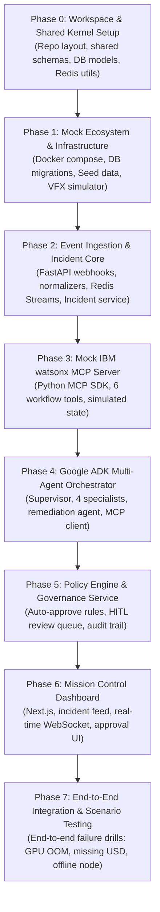

# VFX Pipeline Incident Investigation & Remediation Platform

## Development Plan & MVP Implementation Roadmap — v1.0

---

## 1. Executive Summary & Strategy

This document outlines the phased development plan for the VFX Pipeline Incident Investigation & Remediation Platform. The objective is to build a reliable, event-driven multi-agent platform capable of ingesting VFX pipeline failures, running multi-agent root-cause investigations via Google ADK, and executing remediations through an MCP-compliant IBM watsonx Orchestrate mock server with human-in-the-loop governance.

### Core Guiding Principles for MVP
1. **100% Mocked Periphery**: All external VFX systems (ShotGrid, Deadline, Tractor, OpenCue, USD/storage) and external enterprise systems (IBM watsonx Orchestrate) are simulated with realistic mock servers and data fixtures.
2. **Contract-First Development**: Schemas (Pydantic v2) and protocol contracts (Redis Streams, REST API, MCP tool schemas) are locked down first in the `shared/` package.
3. **End-to-End Tracer Bullet**: Build a vertical slice from simulated event ingestion to dashboard display early (Phase 2/3), then expand specialist agent depth and governance controls.
4. **Deterministic & Inspectable Agent Runs**: All Google ADK agent runs, sub-agent delegations, tool calls, and outputs are logged to PostgreSQL for replayability and UI visualization.

---

## 2. MVP Implementation Order

The implementation is broken into **7 structured phases**, ordered strictly by dependency graph:

---

## 3. Detailed Phase Breakdown

### Phase 0: Workspace & Shared Kernel
**Objective**: Establish repository skeleton, configuration management, and the `shared` Python library.

- **Tasks**:
  1. Initialize monorepo root (`pyproject.toml`, `.env.example`, `.gitignore`, `README.md`).
  2. Implement `shared/shared/enums.py`:
     - `SourceSystem`, `VFXEventType`, `Severity`, `IncidentStatus`, `AgentType`, `RemediationStatus`, `GovernanceDecision`, `NodeStatus`.
  3. Implement `shared/shared/schemas/`:
     - `events.py`: `RawVFXEvent`, `NormalizedVFXEvent`, `VFXEntity`, inter-service event models (`IncidentCreatedEvent`, etc.).
     - `incidents.py`: Incident request/response DTOs, timeline items, query filters.
     - `agents.py`: Typed inputs and outputs for Supervisor, Render QA, Hardware Diagnostic, Asset Validation, Historical Evidence, and Remediation Strategy agents.
     - `remediation.py`: `RemediationPlan`, `RemediationAction`.
     - `governance.py`: Policy rules and decision schemas.
     - `mcp_tools.py`: Request and response models matching MCP tools.
  4. Implement `shared/shared/models/`:
     - SQLAlchemy 2.0 ORM models for all database tables: `projects`, `incidents`, `events`, `investigations`, `agent_executions`, `remediation_plans`, `remediation_actions`, `governance_decisions`, `render_nodes`, `historical_patterns`.
  5. Implement `shared/shared/redis/`:
     - Asynchronous Redis Streams publisher (`RedisStreamPublisher`) and consumer with consumer groups (`RedisStreamConsumer`).
  6. Shared settings class with `pydantic-settings`.
- **Deliverable**: Tested `shared` package installable via editable pip install across all services.

---

### Phase 1: Local Infrastructure & Mock Ecosystem
**Objective**: Bootstrapping local dependencies and synthetic VFX test harnesses.

- **Tasks**:
  1. Configure `docker-compose.yml`:
     - PostgreSQL 16 container with health check.
     - Redis 7 container with append-only persistence.
  2. Setup Alembic database migrations:
     - Generate initial migration schema from SQLAlchemy models.
     - Write database seed script (`db/seed/`) for sample projects (`"Avatar3_VFX"`, `"Dune3_Comp"`), render nodes (`"render-node-01"` to `"render-node-20"`), and historical pattern records.
  3. Implement VFX Event Simulator (`mocks/simulator/`):
     - Scenario generator for:
       - **Render failure**: Arnold GPU Out-of-Memory error on frame 1042.
       - **Asset failure**: Corrupt/missing `.usd` or `.vdb` sequence on shared network storage.
       - **Node failure**: Hardware thermal throttle / GPU PCIe error on render blade.
       - **License exhaustion**: 0 Houdini Mantra licenses available during peak comp window.
     - CLI command `python -m mocks.simulator --scenario render_oom --target http://localhost:8001`.
- **Deliverable**: Single-command infrastructure launch (`docker compose up`) with pre-seeded database and event generator CLI.

---

### Phase 2: Ingestion & Incident Management Services
**Objective**: Ingest heterogeneous events, normalize them into canonical schemas, correlate them, and create incidents.

- **Tasks**:
  1. Build `event-ingestion` service (`:8001`):
     - FastAPI application with lifespan management.
     - Webhook routes: `/api/v1/webhooks/shotgrid`, `/deadline`, `/tractor`, `/opencue`, `/asset-storage`.
     - Normalizer adapters implementing `EventNormalizer` base interface:
       - `ShotgridNormalizer`: Transforms version/publish/status changes.
       - `DeadlineNormalizer`: Extracts exit codes, machine IDs, log snippets from render errors.
       - `TractorNormalizer`: Normalizes blade error codes and blade status.
       - `OpenCueNormalizer`: Normalizes frame aborts and memory exceedance.
       - `AssetStorageNormalizer`: Normalizes missing filepaths, permission errors, inode alerts.
     - Publish `NormalizedVFXEvent` to Redis Stream `vfx.events.normalized`.
  2. Build `incident-manager` service (`:8002`):
     - Redis Stream consumer listening to `vfx.events.normalized`.
     - Correlation engine: checks for existing active incidents matching `entity_id` or `error_signature` within a 15-minute rolling window.
     - Auto-escalation logic: updates incident severity if repeated events occur.
     - Persistence into `incidents` and `events` PostgreSQL tables.
     - Publish `IncidentCreatedEvent` to `incidents.created`.
     - REST API endpoints for incident querying, detail view, timeline, and status updates.
- **Deliverable**: Incoming webhooks from the simulator create correlated incidents in PostgreSQL and emit events to Redis Streams.

---

### Phase 3: Mock IBM watsonx Orchestrate MCP Server
**Objective**: Provide a realistic, standards-compliant MCP server exposing production remediation tools.

- **Tasks**:
  1. Build `services/mcp-watsonx-mock` (`:8005`):
     - Utilize MCP Python SDK with Streamable HTTP transport (and stdio fallback).
     - Maintain an in-memory simulated state of external systems (`mock_state.py`):
       - Simulated ShotGrid shots (`"SH_010"`, `"SH_020"`).
       - Simulated farm queue and node statuses.
       - Simulated Slack/Teams message log.
       - Simulated issue tracker tickets.
  2. Implement the 6 MCP tools:
     - `assign_pipeline_td(incident_id, td_name, priority, department, notes)`
     - `retry_job_on_healthy_node(job_id, excluded_nodes, priority_boost, max_retries, frame_range)`
     - `update_shot_status(project, sequence, shot, new_status, notes, updated_by)`
     - `create_incident_ticket(title, description, severity, category, assignee, related_incident_id, labels)`
     - `notify_team(channel, message, urgency, mentions, thread_id)`
     - `generate_postmortem_report(incident_id, title, investigation_summary, root_cause, timeline, actions_taken, preventive_measures, affected_shots, affected_artists)`
  3. Provide mock inspector test harness to verify MCP tools independently.
- **Deliverable**: Autonomous MCP server ready to accept JSON-RPC tool calls from AI clients.

---

### Phase 4: Google ADK Multi-Agent Orchestration Service
**Objective**: Multi-agent investigation and remediation generation using Google ADK and Gemini.

- **Tasks**:
  1. Build `agent-orchestrator` service (`:8003`):
     - Redis consumer listening to `incidents.created`.
     - Google ADK integration runtime.
  2. Implement Domain Tools for Agents (`tools/`):
     - `render_tools.py`: Read simulated render logs, parse GPU VRAM allocations, inspect shader stack traces.
     - `hardware_tools.py`: Query node telemetry (ECC errors, memory leaks, thermal sensors).
     - `asset_tools.py`: Inspect simulated USD stage composition, texture resolution, file paths.
     - `history_tools.py`: Query past similar incidents from `historical_patterns` and resolved incidents in PostgreSQL.
  3. Implement Google ADK Specialist Agents (`LlmAgent`):
     - **Render QA Agent**: Specializes in Arnold/Mantra/RenderMan logs, syntax, and memory limits.
     - **Hardware Diagnostic Agent**: Assesses blade health, recommends node quarantine if hardware fault detected.
     - **Asset Validation Agent**: Verifies USD file composition, checks for missing texture paths or broken relative links.
     - **Historical Evidence Agent**: Matches current incident fingerprint against historical records, assesses recurrence risk.
     - **Remediation Strategy Agent**: Synthesizes specialist outputs, drafts remediation plan with ordered MCP actions.
  4. Implement **Supervisor Agent**:
     - Evaluates the incoming incident context.
     - Routes dynamically to relevant specialists using Google ADK sub-agent delegation.
     - Aggregates findings into a unified `investigation_result`.
     - Logs all agent interactions, inputs, outputs, and token metrics to `investigations` and `agent_executions` DB tables.
  5. Connect MCP Client:
     - Connects to `mcp-watsonx-mock`.
     - Binds MCP toolset for the execution phase.
     - Publishes `remediations.proposed` to Redis Streams.
- **Deliverable**: Incident creation triggers Google ADK multi-agent investigation, producing structured root cause diagnostics and remediation proposals.

---

### Phase 5: Policy Engine & Governance Service
**Objective**: Policy validation, auto-approval thresholds, and Human-in-the-Loop review.

- **Tasks**:
  1. Build `governance` service (`:8004`):
     - Redis consumer listening to `remediations.proposed`.
  2. Implement Policy Rules Engine:
     - Rule: Low risk + High confidence (>= 0.85) + non-destructive action (e.g. notify or assign TD) -> `AUTO_APPROVED`.
     - Rule: Destructive action (quarantine node, restart render job) or Critical severity -> Requires `HUMAN_APPROVAL`.
     - Rule: Shot status modification -> Requires Lead approval.
  3. Implement Approval Management REST API:
     - `GET /api/v1/approvals/pending`
     - `POST /api/v1/approvals/{plan_id}/approve`
     - `POST /api/v1/approvals/{plan_id}/reject`
     - Audit trail logging into `governance_decisions`.
  4. Emit `governance.decisions` to Redis Streams.
  5. Agent Orchestrator consumes `governance.decisions`:
     - If approved: invokes MCP client to execute the remediation actions on `mcp-watsonx-mock`.
     - Emits `remediations.executed` to update incident status to `RESOLVED`.
- **Deliverable**: Automated policy enforcement with manual review capabilities for risky remediation steps.

---

### Phase 6: API Gateway & Mission Control Dashboard
**Objective**: Real-time user interface for operators, leads, and pipeline TDs.

- **Tasks**:
  1. Build `api-gateway` (`:8000`):
     - BFF (Backend for Frontend) consolidating endpoints from all backend services.
     - WebSocket hub: broadcasts Redis stream updates (`incidents.created`, `investigations.completed`, `remediations.executed`) directly to connected browser clients.
  2. Build Next.js 14+ Dashboard (`dashboard/` on `:3000`):
     - **Mission Control Overview**:
       - Real-time incident triage feed with live severity badges.
       - Studio health widgets (active render nodes, open incidents by department, MTTR chart).
     - **Incident Detail & Agent Investigation View**:
       - Visual agent investigation graph showing Supervisor delegation, Specialist findings, confidence score, and root cause summary.
       - Terminal/log viewer displaying raw error logs and node telemetry.
     - **Remediation & Governance Approval Queue**:
       - Review remediation plan actions before execution.
       - "Approve Plan", "Modify Actions", or "Reject Plan" with one click.
       - Real-time execution logs showing MCP tool calls and responses.
     - **VFX Simulator Trigger Control**:
       - Interactive demo toolbar to fire synthetic incident scenarios directly from the UI.
- **Deliverable**: Fully interactive Mission Control web dashboard with live WebSocket feeds.

---

### Phase 7: End-to-End Testing & Demonstration Scenarios
**Objective**: End-to-end verification across realistic VFX studio failure drills.

- **Test Scenarios**:
  1. **Drill 1: Arnold GPU Out-of-Memory**:
     - *Event*: Deadline reports frame failure with Arnold code 105 (`VRAM limit reached: 24GB required, 16GB available`).
     - *Agents*: Render QA detects texture mipmap bloat; Hardware Diagnostic confirms GPU is healthy but under-spec'd; Historical Evidence shows similar shot succeeded on 48GB A6000 nodes.
     - *Remediation*: Reroute job to high-VRAM pool, notify lighting artist, assign Pipeline TD.
  2. **Drill 2: Corrupt USD Stage Asset**:
     - *Event*: Asset storage reports missing layer composition in `/show/seq/shot/usd/lighting.usd`.
     - *Agents*: Asset Validation parses USD dependency graph and identifies missing sublayer; Render QA confirms scene aborts at frame 1.
     - *Remediation*: Put shot on hold, create ticket for Asset TD, notify shot owner.
  3. **Drill 3: Failing Render Farm Blade**:
     - *Event*: Tractor reports 5 consecutive job aborts on `blade-042` with PCIe bus errors.
     - *Agents*: Hardware Diagnostic flags PCIe link errors and thermal surge, calculates node health 0.12; recommends quarantine.
     - *Remediation*: Auto-approve node quarantine, retry affected jobs on healthy node.
- **Deliverable**: Comprehensive test suite (unit + integration + end-to-end test scenarios).

---

## 4. Dependencies & Prerequisites

| Dependency | Required Version | Purpose |
|---|---|---|
| **Python** | `>= 3.12` | Core language for all microservices |
| **Node.js** | `>= 20.x` | Next.js Mission Control Dashboard |
| **Docker & Docker Compose** | `>= 24.x` | Multi-container local execution |
| **PostgreSQL** | `16-alpine` | Relational storage for incidents & audit logs |
| **Redis** | `7-alpine` | In-memory message broker & event stream |
| **Google ADK** | Latest (`google-adk`) | Multi-agent orchestration framework |
| **Gemini API Key** | `GEMINI_API_KEY` | Model reasoning engine |
| **MCP Python SDK** | `>= 2.0` | Model Context Protocol implementation |

---

## 5. Verification & Acceptance Criteria

| Component | Acceptance Criteria |
|---|---|
| **Event Ingestion** | Accepts payload from any of the 5 VFX mock systems, validates schema in `< 50ms`, outputs valid canonical event to Redis. |
| **Incident Manager** | Deduplicates identical events within time window, creates single incident, emits event to `incidents.created`. |
| **Agent Orchestrator** | Supervisor invokes relevant specialists; outputs structured JSON with root cause and confidence rating `> 0.0`. |
| **watsonx MCP Server** | All 6 tools execute within `< 200ms`, mutate mock state, and return conforming JSON responses. |
| **Governance Engine** | Correctly evaluates safety policy; blocks risky actions until approval API receives human sign-off. |
| **Dashboard** | Connects to WebSocket, receives live incident update within `< 200ms` of event ingestion without page refresh. |
| **E2E Scenario** | Ingesting a synthetic render failure completes investigation, approval, and mock remediation without manual code interventions. |
